# <em> Conversor de divisas y temperatura. </em>

**Solución al Challenge ONE Back End - Java (Sprint 01) ➡️ Conversor de divisas.**

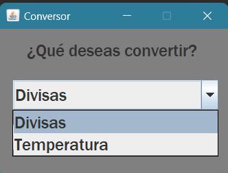
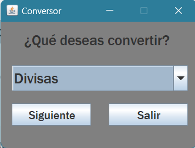 

**Contenido.**
---
### 1. Descripción.
### 2. Avance.
### 3. Pruebas y ejemplos.
### 4. Tecnologías utilizadas.
### 5. Créditos.
***
**1. Descripción.**
---
### Este proyecto es un conversor de divisas y de temperatura.
### Las divisas que manejan son:
- ### Pesos mexicanos (MXN)
- ### Dólar estadounidense (USD)
- ### Euro (EUR)
- ### Libra esterlina (GBP)
- ### Yen japonés (JPY)
- ### Won surcoreano (KRW)

### Se pueden convertir grados de temperatura desde y hacia *Celsius*, *Fahrenheit* y *Kelvin*.
***
**2. Avance**
---
### El proyecto ya se finalizó. Aún se podrían agregar otras características que lo convirtieran en un proyecto más completo.
***
**3. Pruebas y ejemplos**
---
  
### Dentro del programa tenemos las opciones de conversion de divisas y de conversion de temperatura.

  

### En el apartado de conversión de divisas tenemos dos ventanas, la primera nos muestra las tasas de conversión que se están utilizando y las monedas de las cuales se puede realizar la conversión.  
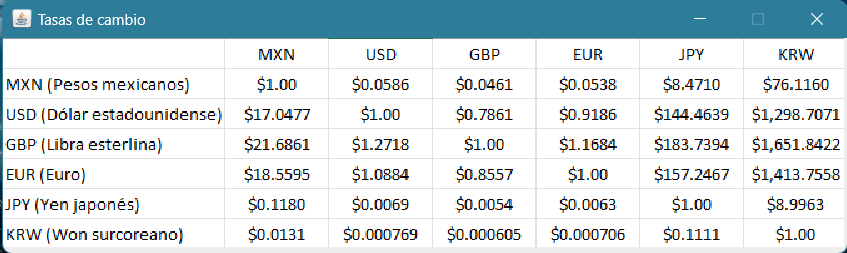  

### La segunda ventana es la ventana de conversión propia, contamos con una caja para ingresar el valor del cuál queremos realizar la conversión, don menús de opciones desplegables en los cuales podemos decidir a partir de qué moneda queremos realizar la conversión y hacia qué moneda la queremos realizar, un botón para poder realizar la conversión, una caja donde mostrar el resultado y dos botones extra, uno para regresar a la ventana anterior y otro para salir de la aplicación.
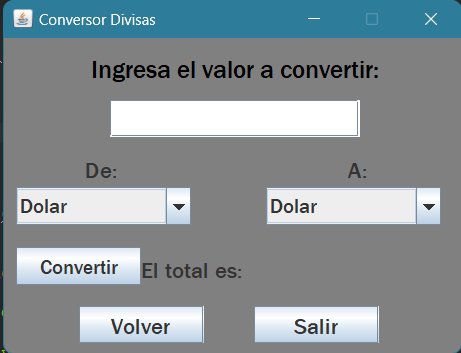
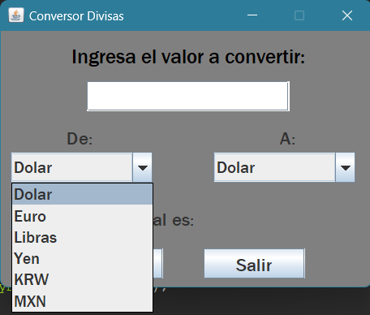
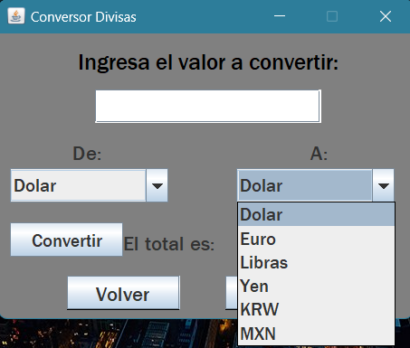  

### En el apartado de conversión de temperatura tenemos solamente una ventana la cual cuenta con un diseño muy parecido con la ventana de conversión de divisas pero en esta contamos con una pequeña tabla que muestra una conversión de cada tipo de grado a otro diferente.
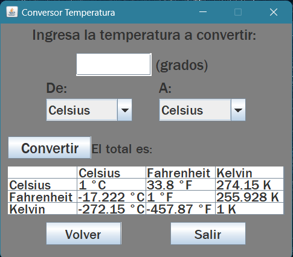
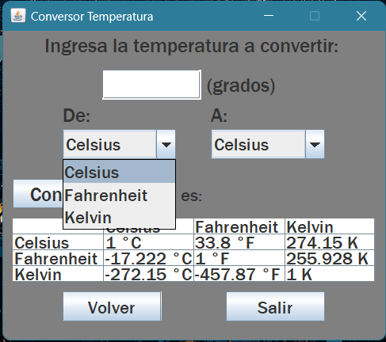
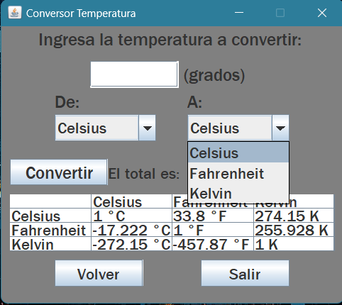   

### En caso de que no se ingrese ningún valor o se ingrese una letra, el programa muestra una ventana con un mensaje de *Valor Inválido*, permitiendo cerrar está ventana para volver a intentar con un valor numérico.  
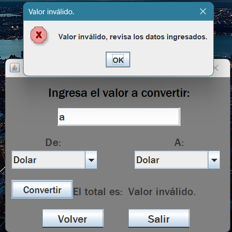
  

### Todas las conversiones se realizan de una opción hacia otra y viceversa.
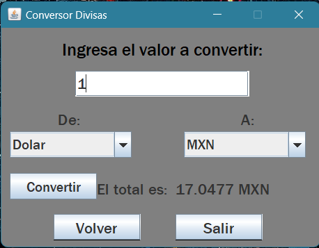
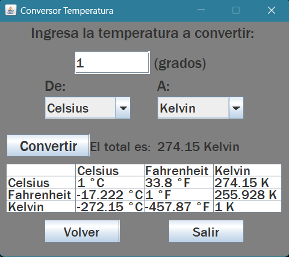

### **En el siguiente GIF podemos observar el funcionamiento del programa.**
  
***
**4. Tecnologías utilizadas.**
---
### Para los aspectos gráficos (UI) de la aplicación se utilizaron las clases *JFrame*, *JLable*, *JOptionPane*, *SwingConstants*, *JTextField*, *JComboBox*, *DefaultComboBox* y *JButton* de la biblioteca ***Swing***; igualmente se utilizaron las clases *Color*, *Font*, *ActionListener* y *ActionEvent* de la biblioteca ***awt*** (***Abstract Window Toolkit***).  
### La lógica de la aplicación se realizó utilizando *Orientación a Objetos* en ***Java*** y se utilizaron las clases *HashMap* y *Map* de la biblioteca ***Util*** de ***Java***.
***
**5. Créditos.**
---
### Está aplicación la realicé yo, ***Gerardo Gabriel Santana Amezcua***, utilizando los conociemientos adquiridos gracias al programa ***ONE*** de ***Oracle*** y ***Alura Latam***. También gracias a los conociemientos adquiridos en la carrera **Ingeniería en Computación** en la **Facultad de Ingeniería** de la ***UNAM***.